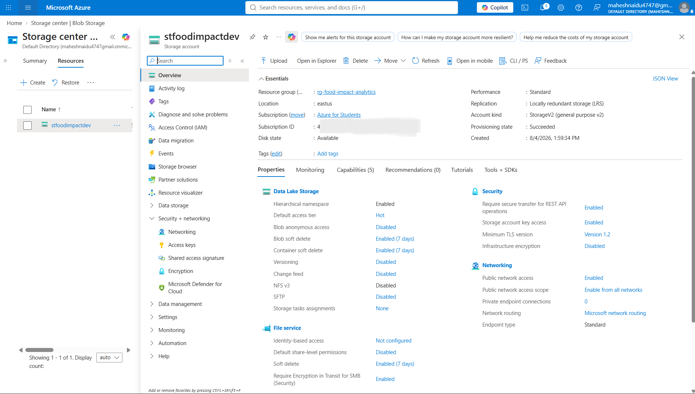
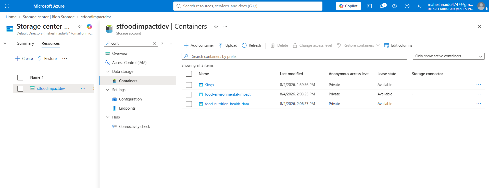
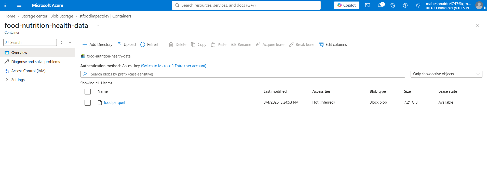
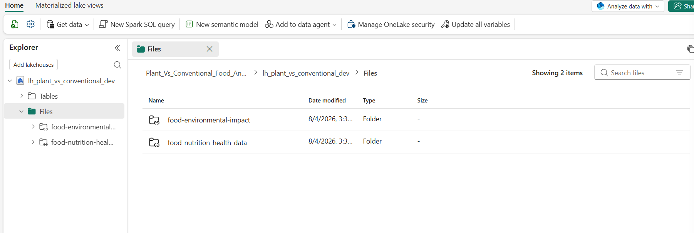
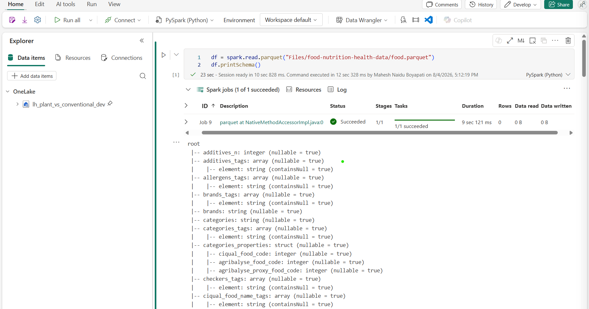
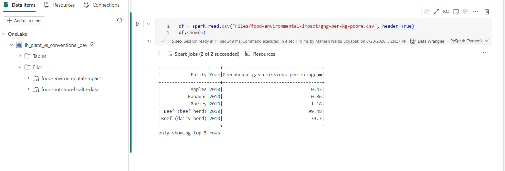

# DE-food-impact-analytics
A data engineering project comparing the environmental footprint and health profile of plant-based foods vs. conventional/animal-based foods, built on Microsoft Fabric using PySpark, OneLake, and Direct Lake Power BI.

# Plant-Based vs. Conventional Food Environmental & Health Impact Analytics

I wanted a project that used real public data instead of generated/mock data, and that forced me to deal with actually messy source data instead of something pre-cleaned. Food turned out to be a good fit for that — there's a well-known environmental impact study (Poore & Nemecek) and a huge, genuinely messy open product database (Open Food Facts), and combining the two lets you compare plant-based vs. conventional foods on both environmental and health grounds at once.

The goal is a working pipeline end to end — raw ingestion, cleaning, transformation, reporting — on Microsoft Fabric, built the way a real team would build it rather than a tutorial version.

## Architecture

Standard medallion setup on one Fabric Lakehouse:
- **Bronze** — raw data landed via OneLake Shortcuts, untouched
- **Silver** — cleaned Open Food Facts data, plus a mapping table linking it to the Poore & Nemecek commodity categories
- **Gold** — the actual comparison tables, feeding a Power BI report over Direct Lake

## Data

| Source | What it gives me |
|---|---|
| Open Food Facts | Nutri-Score, NOVA group, nutrients, category tags — messy, raw, needs real cleaning |
| Poore & Nemecek (2018), via Our World in Data | GHG emissions, land use, freshwater withdrawal per kg, across ~40 food categories — curated research data, treated as reference data rather than something to "clean" |

---

## Phase 1: Fabric Environment Setup

Set up the Fabric side before touching any data:
- Fabric workspace: `Plant_Vs_Conventional_Food_Analytics_Dev` (Trial Capacity, Central US)
- Lakehouse: `lh_plant_vs_conventional_dev`

Nothing to report on the challenges front for this one — it was just clicking through the Fabric UI.

---

## Phase 2: Raw Data Staging & Bronze Ingestion via OneLake Shortcuts

This phase ended up being most of the actual work so far, and most of the real problems.

Set up an ADLS Gen2 storage account (`stfoodimpactdev`, Central US, Standard/LRS, hierarchical namespace on) to stage both datasets before bringing them into Fabric.



Two containers, named for what's actually in them rather than where they came from — `food-nutrition-health-data` and `food-environmental-impact` — since I figured six months from now I won't remember what "owid" stands for.



Grabbed the three Poore & Nemecek CSVs straight from Our World in Data's grapher URLs. Open Food Facts was the bigger job — pulled the Parquet export (~7.2GB) from Hugging Face through Azure Cloud Shell instead of downloading to my laptop first, so the transfer happened inside Azure's network rather than over my home connection twice. Before uploading it anywhere, read it back with pandas to make sure it wasn't truncated — came back with 4,655,195 rows, so the file was intact.



Along the way I hit a subscription issue unrelated to this project's actual data work — an old resource group from a different project had left networking infrastructure running in the background for months, billing hourly regardless of use. Tracked it down through Cost Analysis, deleted it, and set a $5 budget alert so it can't happen silently again. Also hit an RBAC gap where `az storage blob upload --auth-mode login` just hung — being subscription Owner isn't the same as having the `Storage Blob Data Contributor` data-plane role. Worked around it with an account-key-based SAS token instead, generated from the portal.

One more that cost some time: pasted a SAS token into a bash variable without quotes. SAS tokens are full of `&` characters, and bash reads unquoted `&` as "run this in the background" — so it silently split the token into several background jobs and only kept the first fragment. Got a `403 AuthorizationPermissionMismatch` and assumed it was a permissions problem again, when it was actually just a quoting bug. Lesson: always wrap tokens in single quotes.

Then created two OneLake Shortcuts (ADLS Gen2, SAS token auth) from the Lakehouse into those two containers. Skipped the "Transform to Delta" option Fabric offers during shortcut setup — didn't want any transformation logic sneaking into Bronze before I've even written the Silver notebook.



**Technical detail:**
- Storage account: `stfoodimpactdev`
- Containers: `food-nutrition-health-data`, `food-environmental-impact`
- Shortcuts: same names, under Lakehouse `Files/`
- Files: `food.parquet` (~7.2GB), `ghg-per-kg-poore.csv`, `land-use-per-kg-poore.csv`, `water-withdrawals-per-kg-poore.csv`

**Verifying the shortcuts actually work, not just exist:**

Configuring a shortcut in the Fabric UI doesn't guarantee it's actually readable — so I ran a quick read against each one from a notebook to confirm.

First, the Open Food Facts shortcut — read the Parquet file and print its schema:

```python
df = spark.read.parquet("Files/food-nutrition-health-data/food.parquet")
df.printSchema()
```



Then the OWID shortcut — read one of the CSVs and show a few rows:

```python
df = spark.read.csv("Files/food-environmental-impact/ghg-per-kg-poore.csv", header=True)
df.show(5)
```



The second check also caught a real issue: the first SAS token I used was only valid for a few hours, so by the time I got around to verifying the OWID shortcut it had already expired, throwing a `403 AccessDenied`. Fixed by generating a new SAS token with a much longer expiry (months instead of hours) and updating the shortcut's connection under Fabric's Manage Connections and Gateways. Worth just setting a long expiry from the start next time instead of the short default.

---

## Phase 3: Silver Transformation
Not started.

This is where the real cleaning happens — deduping Open Food Facts, handling nulls, standardizing units, and building the category-mapping table that links thousands of branded products to ~40 commodity categories from the Poore & Nemecek side. That mapping isn't a clean join and I expect it to take a while.

## Phase 4: Gold Aggregation
Not started. Fact/dimension tables combining health and environmental metrics by food category.

## Phase 5: Power BI Reporting
Not started. Direct Lake report comparing plant-based vs. conventional, maybe a basic substitution-scenario view if there's time.

---

## Stack
Microsoft Fabric (Lakehouse, OneLake, Data Pipelines), PySpark, Delta Lake, Power BI (Direct Lake), Azure Data Lake Storage Gen2, Azure Cloud Shell / AzCopy.

## Status
- [x] Phase 1: Fabric Environment Setup
- [x] Phase 2: Raw Data Staging & Bronze Ingestion via OneLake Shortcuts
- [ ] Phase 3: Silver Transformation
- [ ] Phase 4: Gold Aggregation
- [ ] Phase 5: Power BI Reporting

## Data credit
- Open Food Facts data © Open Food Facts contributors, ODbL license.
- Environmental data: Poore, J., & Nemecek, T. (2018). *Reducing food's environmental impacts through producers and consumers.* Science, 360(6392), 987–992. Via Our World in Data, CC BY.

## Author
Mahesh Boyapati
